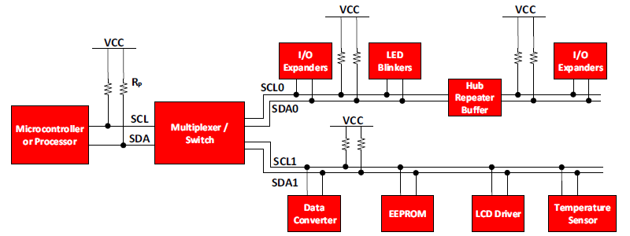
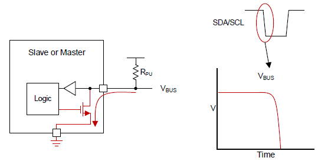
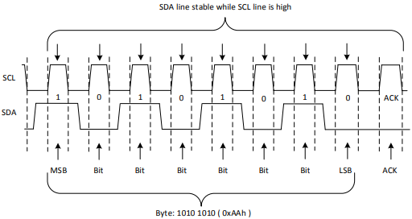

# I2C

## 概念

`I2C` 是Philips公司开发的一种简单的、两线制的通用串行总线。采用主从模式，包含单主单从、单主多从、多主单从和多主多从四种模式。

`I2C`总线包含两条线，一条时钟线`SCL`和一条数据线`SDA`，数据线使用半双工模式。每个`I2C`设备既可以作为主设备，也可以作为从设备，如果多个设备同时传输，可以通过冲突检测和仲裁防止数据破坏。

## IO 漏极开路

SCL/SDA 总线管脚使用 **漏极开路** 方式，默认处于高阻态，所以需要上接上拉电阻。

当输出 **低电平** 时，可以通过控制逻辑接口下拉FET，从而使FET导通，并输出低电平。

当输出 **高电平** 时，可以通过控制逻辑接口释放FET，此时总线浮空，上拉电阻提供高电平输出。

关于 **漏极开路**, **推挽输出**, 可以参考：

- [知乎 如何正确的理解漏极开路输出跟推挽输出？](https://www.zhihu.com/question/28512432/answer/41217074)

## I2C 数据传输

### 传输流程

假设主设备要发送数据给从设备，其发送流程如下：

1. 主设备发送一个 **START** 信号
2. 主设备发送从设备地址
3. 主设备发送数据到从设备 （数据可以是从设备寄存器地址，或是具体数据）
4. 主设备发送 **STOP** 信号结束传输

同样的，如果主设备需要接收数据，其接收流程如下：

1. 主设备发送一个 **START** 信号
2. 主设备发送从设备地址
3. 主设备发送请求数据对应的寄存器地址给从设备
4. 主设备从从设备接收数据
5. 主设备发送 **STOP** 信号结束传输

### START / STOP

I2C 的通信都是通过START开始和STOP结束的。

- **`START`**： `SCL`保持高电平的同时，`SDA`从高电平切到低电平，产生一个下降沿
- **`STOP`**: `SCL`保持高电平的同时，`SDA`从低电平切到高电平，产生一个上升沿

!!! note
    1. `START` 信号可以在发送`STOP`之前重复发送，代表开始一个新的传输，这是防止`STOP`后被其它主设备抢占总线;
    2. `START`, `STOP` 属于控制信号，其时序与正常数据收发不同，正常收发时，`SCL`高电平时不允许`SDA`发生改变。

### 发送字节

发送单个字节时，其时序如下：

SDA数据在SCL高电平时保持不变，在SCL低电平时修改数据，也就是说，SCL高电平时为有效数据。每个字节发送完毕以后，主设备需要释放SDA总线，等待从设备发送ACK应答信号，代表从设备已接收数据并准备好接收下一个字节。

!!! tip
    主设备 **释放** SDA总线，意味着主设备SDA接口的FET被释放处于浮空，此时SDA默认呈现高电平，需要从设备将其拉低(pull down), 也就是这里的`ACK`.

### ACK / NACK

在上面已经提到了ACK，ACK对应一个低电平；有时候也会发送或接收到NACK, 对应一个高电平。

**NACK** 可能出现在以下几种情况：

1. 接收方因为在处理实时函数无法接收或发送数据，还没准备好与主设备通信；
2. 在传输过程中，接收方接收到了无法理解的数据；
3. 在传输过程中，接收方无法接收更多的数据了，可能缓存满了；
4. 主设备作为接收方已经完成了数据接收，提示从设备不再需要数据了。

### Master 发送数据

主设备发送数据给从设备，首先发送一个START信号，然后发送从设备地址，继而发送从设备待写入数据的寄存器地址，然后发送要写入的数据，最后发送STOP结束。

!!! note
    值得注意的是，并不是所有的I2C设备都要发送寄存器地址，某些小型设备可能只有一个寄存器，不需要指定地址就可以直接发送数据。

### Master 接收数据

主设备从从设备接收数据，同样先发送一个START，然后发送从设备地址、寄存器地址，之后与发送不同的是，当接收方返回ACK后，需要重新发送START，这是为了将`R/W`的 **写** 方式改为 **读** , 发送完带有读信号的从设备地址后，从从设备读取数据，读取完后可以主动发送`NACK`给从设备，然后发送STOP结束接收。

## 参考文档

- [TI Understanding the I2C Bus](https://www.ti.com/lit/an/slva704/slva704.pdf)
- [I2C Info – I2C Bus, Interface and Protocol](https://i2c.info/i2c-bus-specification)
- [Understanding the I2C Protocol](https://www.engineersgarage.com/tutorials/understanding-the-i2c-protocol/)
- [BASICS OF THE I2C COMMUNICATION PROTOCOL](https://www.circuitbasics.com/basics-of-the-i2c-communication-protocol/)
- [Basics of I2C Communication | Hardware, Data Transfer, Configuration](https://www.electronicshub.org/basics-i2c-communication/#Start_Condition)
- [Linux I2C驱动框架（超详细）](https://blog.csdn.net/weixin_42462202/article/details/91128914)
