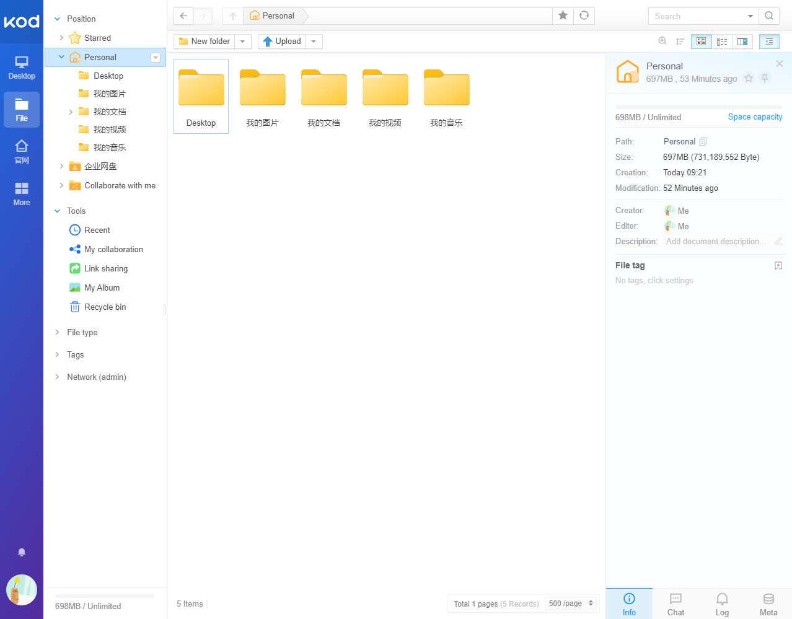

# 部署 kodbox 私人云盘

## 平台

- 板卡：树莓派 4B 或其它arm平台板卡
- 系统：Ubuntu
- 云服务器：阿里云

目标：在本地搭建可道云私人云盘，在具有公网IP的云服务器搭建frp服务实现内网穿透，最终实现随处访问内网私人云盘。

## 安装 mariadb 数据库

> **mariadb** 是 `mysql` 的一个分支，由开源社区维护。

- 安装 mariadb-server

```bash
sudo apt install mariadb-server
```

安装过程可能会要求配置密码。

- 运行安全脚本

```bash
sudo mysql_secure_installation
```

按照提示选择 `Y/N` 即可。

### 添加 kodbox 数据库

```bash
sudo mysql -p
```

```sql
CREATE DATABASE kodbox;
CREATE USER 'kodbox'@'localhost' IDENTIFIED BY 'kodbox账户密码';
GRANT ALL ON kodbox.* TO 'kodbox'@'localhost';
FLUSH PRIVILEGES;
exit
```

## 安装 php5 服务

```bash
sudo apt install redis-server php5 php5-fpm php5-curl php5-gd php5-redis php5-mysql
```

### 添加 php 配置文件

- `/etc/php5/fpm/conf.d/kodbox.ini`

```ini
post_max_size = 500M;
upload_max_filesize = 500M;
memory_limit = 500M;
max_execution_time = 3600;
max_input_time = 3600;
safe_mode = off
request_terminate_timeout = 3600
pm.max_children = 50
pm.start_servers = 10
pm.min_spare_servers = 10
pm.max_spare_servers = 30
pm.max_requests = 500
cgi.fix_pathinfo = 1
date.timezone = "Asia/Shanghai"
```

## 安装 nginx 服务

```bash
apt install nginx
```

> `nginx` 默认站点目录为 `/usr/share/nginx/html/`

### 添加 kodbox 相关配置文件

- `/etc/nginx/conf.d/kodbox.conf`

```log
client_max_body_size 500M;
client_header_timeout 3600s;
client_body_timeout 3600s;
fastcgi_connect_timeout 3600s;
fastcgi_send_timeout 3600s;
fastcgi_read_timeout 3600s;
```

### 配置站点目录

```bash
sudo mkdir -p /var/www/html/kodbox
```

挂载U盘或移动硬盘到 `/var/www/html/kodbox` 目录。

```bash
sudo mkfs.ext4 /dev/sda1
mount -t ext4 /dev/sda1 /var/www/html/kodbox
```

为了方便开机自动挂载，可以修改 `/etc/fstab` 文件。

```bash
/dev/sda1 /var/www/html/kodbox ext4 defaults 0 0 
```

如果是tf卡挂载，设备路径可能是 `/dev/mmcblk0p1`.

### 配置站点信息

- `/etc/nginx/sites-enabled/kodbox`

```bash
server {

    listen 80;
    listen [::]:80;

    root /var/www/html/kodbox;

    server_name 127.0.0.1;

    location / {
        index  index.html index.htm index.php default.html default.htm default.php;
    }

    location ~\.php(.*)$ {
        fastcgi_pass unix:/run/php5-fpm.sock;
        #fastcgi_pass 127.0.0.1:9000;
        fastcgi_param SCRIPT_FILENAME $document_root$fastcgi_script_name;
        include fastcgi_params;
        fastcgi_split_path_info ^(.+\.php)(.*)$;
        fastcgi_param PATH_INFO $fastcgi_path_info;
    }
}
```

修改默认配置文件为 kodbox

```bash
cd /etc/nginx/sites-enabled/
ln -sf kodbox default
```

## 安装 kodbox

接下来就是主角kodbox了，使用以下指令下载并配置。

```bash
cd /var/www/html/kodbox
wget https://static.kodcloud.com/update/download/kodbox.1.34.zip
unzip kodbox.1.34.zip
rm kodbox.1.34.zip

cd ..
chmod -Rf 777 ./*
```

## frp 内网穿透

- 参考文档：<https://www.litreily.top/notes/network/frp>

## 效果验证

> 说明: 配置完成后记得重启设备或各种服务。

以上一切准备就绪后，就可以进行测试了。首先是本地测试，连上开发板，在电脑输入ip地址。

- 正常情况会显示kodbox 引导界面，显示所需配置是否正常，我用的32位系统，所以提示建议64位系统，但不影响使用，其它一切正常。
- 接着下一步就是选择数据库和系统缓存了，我搭配的是`mysql+redis`, 按照提示选择并输入密码即可。
- 最后一步是配置登录的账户密码，配置完成后就可以跳转并登录了。



本地上传下载速度都很快，10MB/s 左右。

接着测试远程访问，通过frp内网穿透功能测试，网络连接正常，但是访问速度显著下降，不过平常主要存储些文档，差不多够用了。

## 参考

- [kodcloud 下载](https://kodcloud.com/download/)
- [树莓派基于kodbox打造私有云盘](https://www.hncldz.com/?p=566)